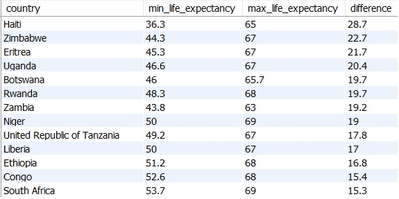
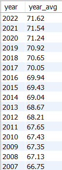
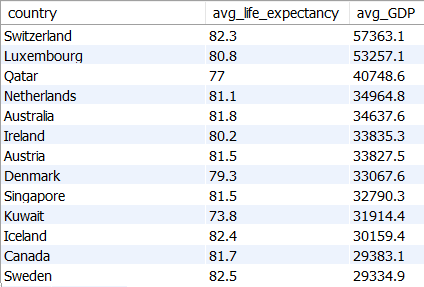
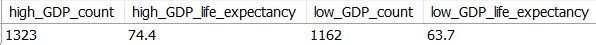
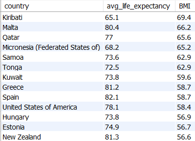

# SQL Project: World Life Expectancy

### Data Cleaning and Exploratory Analysis

#### by Alex Melino

#

### Background and Data Information

This is a sample project done with world life expectancy data. The original data can be populated into a table using an SQL script called 'WorldLifeExpectancyScript', which can be found in the 'Resources' folder within this repo. The original data was downloaded as a .csv file (also located in the 'Resources' folder under the name 'WorldLifeExpectancy.csv'). The script and the data itself was provided by [AnalystBuilder.com](https://www.analystbuilder.com/).

The project is intended to showcase SQL skills regarding data cleaning and some exploratory data analysis.

The original data consists of 2941 rows of data broken down for each country dating from 2007 to 2022. The table columns consist of a variety of information relating to each country's life expectancy, BMI, adult mortality, GDP and much more (18 columns in total).
#

### Data Cleaning

The data required a series of data cleaning steps to ensure that the exploratory data analysis would yield accurate results. The end result can be found in the main directory of this repo under the name 'world_life_expectancy_cleaned.csv'.

The SQL code for the data cleaning queries is located in the main directory of this repo under the name 'data-cleaning.sql'. The main steps taken in this data cleaning example are as follows:

- Identifying and removing duplicate rows

- Identifying rows with blank data for the 'status' column (developed vs developing) and populating those with the appropriate designation

- Identifying rows with blank or null data for the crucial 'life expectancy' column and populating those rows with a value that is the average of the preceding and following years.

- Lastly, countries that had a value of '0' for life expectancy were removed as they all corresponded with tiny countries with which no other data was availble.

The resulting table was now ready for exploratory data analysis to gain some more valuable insights from this data.
#

### Exploratory Data Analysis

In this phase of the project, various information was gleamed using a variety of SQL queries. Some samples of the outputs from these queries can be found within this ReadMe below. Additionally, the full table results for the various queries used can be found in the 'eda_outputs' folder of this repo.

1. The first analysis was to identify the magnitude of improvement in life expectancy over the 15 year period that the data covers. This query returned the maximum and minimum life expectancy for each country and the difference between them which represents the improvement from 2007 to 2022. A sample of the results can be seen in table below which shows the countries which saw the greatest increase in life expectancy.

2. Analysis was done to create a two-column table showing the world's overall average life expectancy broken down by year. This table shows a steady increase in world life expectancy as an global average.

    

3. The next query was aimed at comparing the average life expectancy of every country to its average GDP over the time frame. The intention was to see if there was a correlation between high GDP and higher life expectancy. This query did indeed show that there is a correlation between the two. A visualization for this table can be done using visualization software such as Power BI or Tableau in order to get a better sense of the results. A sample of the table can be seen below:

    

4. Following the findings in step 3 of the exploratory data analysis, the next goal was to obtain a count of low GDP countries vs high GDP countries and compare the average life expectancy. The countries were split on the arbitrary number of 1500 for GDP as that landed somewhere near the middle. This was acheived using CASE statements in the queries. This query also excludes the values of of '0' for GDP as many countries had incomplete data. The following is the result:

    

5. The final step was comparing life expectancy for countries with low vs high BMI data. The query resulted in unexpected numbers (very high BMI values) which hints that the BMI data may be incorrect or not fully explained by the column title. Further analysis would be needed to visualize and determine if the data is credible. The following is a sample of the output for the countries with the highest BMI:
    
#

### Next Steps for Further Analysis

To obtain a proper report from this data, visualization would be the next step. That would allow the analyst to paint a clearer picture of what the data is conveying. Software like Tableau or Power BI would work well. 

Additionally, some python analysis using pandas would also be beneficial, especially for determining if there is correlation between life expectancy and the other columns. 

